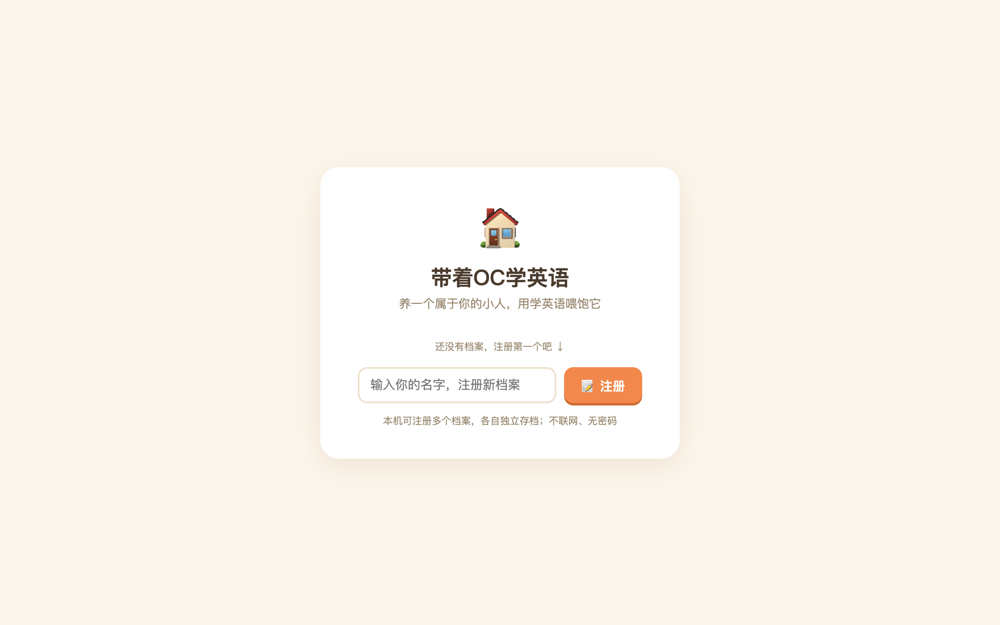
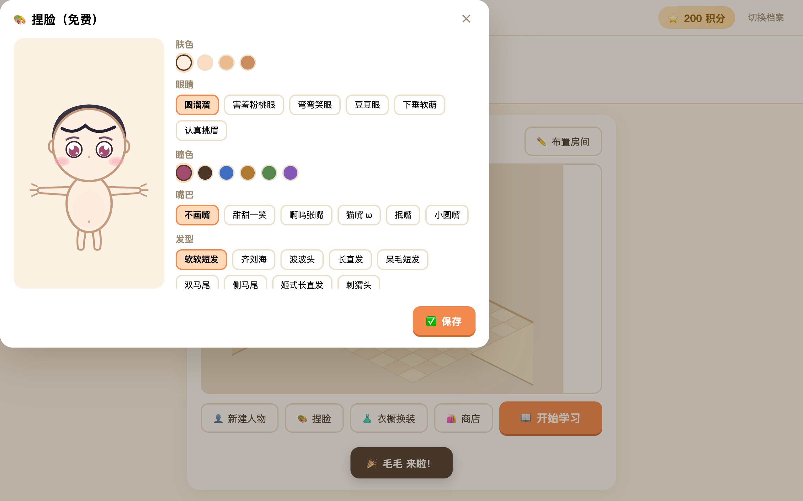
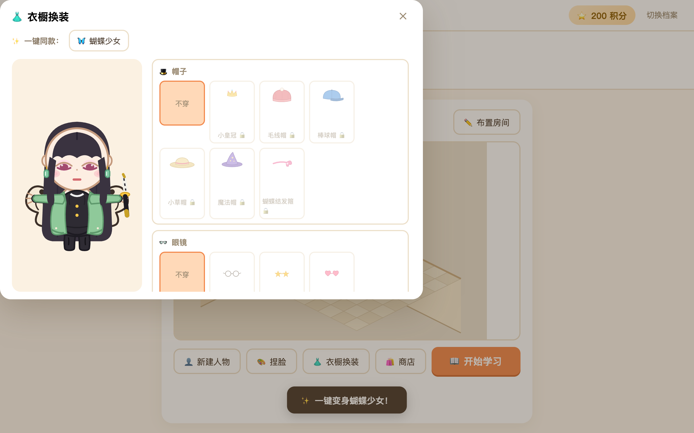
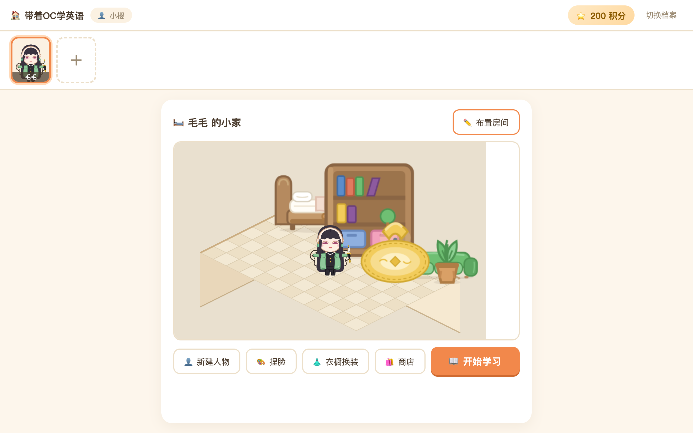
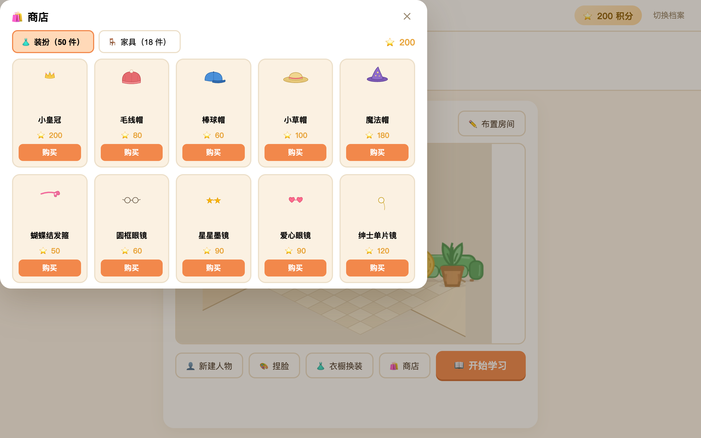
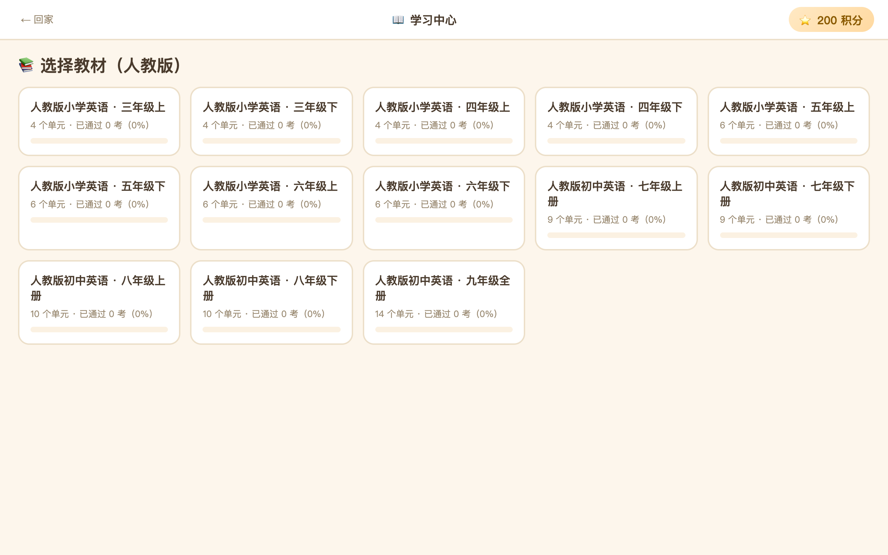
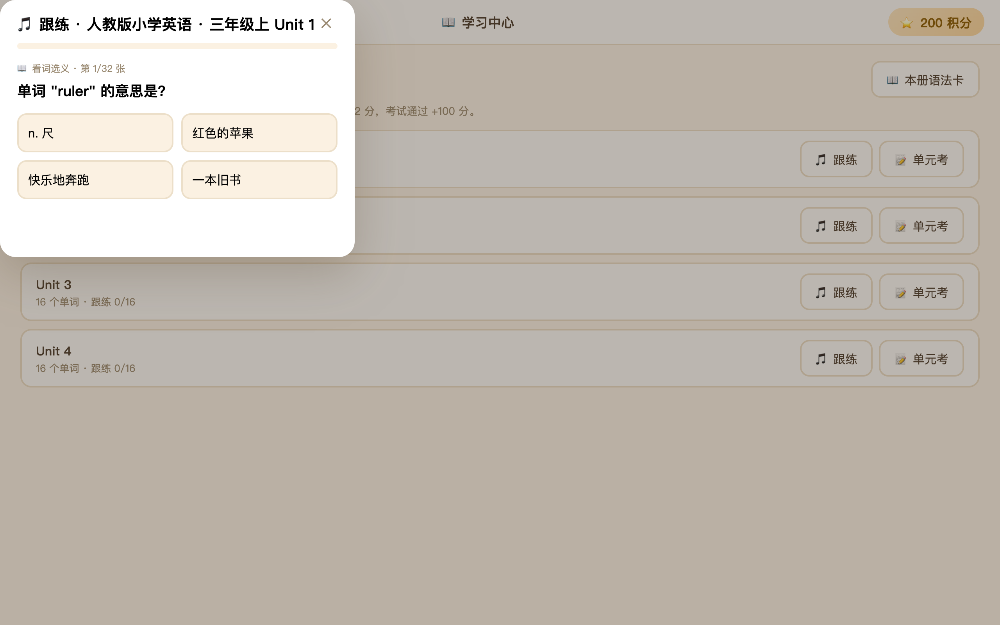

# 带着OC学英语

> 创建一只属于你的 Q 版 OC，给它捏脸、换装、布置小家——而赚积分的唯一方式，是**认真学英语**。

**Tauri 2.0 桌面应用** · Rust 后端 + Vanilla JS 前端 · SVG 矢量 Q 版角色 · PixiJS 等距 2.5D 房间 · macOS

---

## 📸 界面一览

| 注册档案 | 捏脸工坊 |
| :---: | :---: |
|  |  |

| 衣橱换装（一键同款蝴蝶少女） | 2.5D 小家 |
| :---: | :---: |
|  |  |

| 商店 | 学习中心（13 册教材） |
| :---: | :---: |
|  |  |

| 跟练（四选一 + 听力） | 单元考成绩单 |
| :---: | :---: |
|  |  |

> 截图由 `npm run screenshots` 自动生成（无头 Chrome + 契约级后端 mock 跑真实前端）。

---

## 🎮 游戏介绍

### 🧒 创建你的 OC（免费 · 不限数量）

起个名字就能迎接一只空白小人。可以创建多只 OC，每只都有独立的脸蛋、衣柜和小家，随时在人物栏一键切换。

### 🎨 捏脸 + 换装

- **捏脸全免费**：肤色 4 档、眼型 6 款（圆溜溜 / 害羞粉桃眼 / 弯弯笑眼…）、瞳色 6 色、发型 8 款、发色 8 色、嘴巴 5 款 +「不画嘴」、腮红开关
- **9 部位换装系统**：帽子 / 眼镜 / 上衣 / 下装 / 鞋子 / 手持 / 背饰 / 耳饰，共 **50 件装扮**
- **一键同款**：内置「🦋 蝴蝶少女」预设——姬式长直发 + 粉桃眼 + 绿色羽织队服 + 蝴蝶翅膀 + 黑鞘短刀 + 玉耳坠，已拥有的部件一键上身，缺的会提示去商店补
- 角色为纯 SVG 矢量绘制，任意缩放不糊；素体严格按参考模板实现

### 🏠 2.5D 温馨小家

- 等距 2.5D 视角：左墙 + 后墙（带窗户挂画）+ 菱形地砖，家具有贴地投影和立体层次
- **18 件家具**：三张床、书桌、书架、沙发、电视、钢琴、地毯、猫窝（里面睡着一只猫）…
- 布置模式下拖动家具自由摆放，自动吸附网格；放不下会回弹；右键收进收纳箱

### 📖 学英语（人教版同步）

- **13 册教材**：人教版小学英语三年级上~六年级下（8 册）+ 初中七年级上~九年级（5 册），单元与课本同步
- **语法卡**：每册配套语法讲解，学习前先翻卡
- **跟练**：每个单词两张卡——词义四选一 + 🔊 听力辨词，答对即学会
- **单元考**：跟练全部完成后解锁，15 题（8 词义 + 4 听力 + 3 语法），**≥12 题通过**
- 答题带朗读（系统 TTS），错题附解析

### ⭐ 积分经济

积分是唯一的货币，**只能靠学习赚取**，用来买装扮和家具装扮 OC 与小家。

| 事件 | 积分 |
| --- | ---: |
| 🎁 新手礼包 | +200 |
| 🎵 跟练答对一张卡 | +2 |
| 🏆 单元考首次通过 | +100 |
| 📈 再次通过且刷新最佳 | 每多对 1 题 +10 |

---

## 🛠️ 技术栈

| 层 | 技术 |
| --- | --- |
| 壳 | Tauri 2.0（Rust），包体 ~10MB |
| 后端 | Rust：存档/商店/题库/出题/考试判分全部在 Rust 侧，数据编译进二进制 |
| 前端 | Vanilla JS（ES Modules，零框架零打包器） |
| 角色 | SVG 矢量分层组装（素体 → 装扮 9 层 → 五官 → 发型） |
| 房间 | PixiJS（WebGL）等距 2.5D 场景，SVG → 纹理 |
| 存档 | JSON，位于系统应用支持目录 |

## 📁 目录结构

```
├── src/                    # 前端（Vanilla JS）
│   ├── index.html          # 单页界面（注册/主界面/学习中心 + 7 个弹窗）
│   ├── main.js             # 交互逻辑（捏脸/衣橱/预设/商店/房间/跟练/考试）
│   ├── styles.css          # 暖色卡通主题
│   ├── lib/pixi.min.js     # PixiJS（本地 UMD）
│   └── js/
│       ├── api.js          #   Tauri invoke 封装
│       ├── character.js    #   素体 + 五官/发型/装扮分层渲染器
│       ├── wardrobe.js     #   50 件装扮 SVG 素材（9 部位）
│       ├── furniture.js    #   18 件家具 SVG 素材
│       ├── room.js         #   等距 2.5D 房间（Pixi，拖拽/吸附/深度排序）
│       └── tts.js          #   单词朗读
├── src-tauri/              # Rust 后端
│   ├── src/
│   │   ├── models.rs       #   存档数据结构（档案/人物/脸型/装扮/进度）
│   │   ├── commands.rs     #   Tauri 指令（注册/创建/换装/购买/摆放…）
│   │   ├── content.rs      #   13 册教材 + 语法卡加载
│   │   ├── questions.rs    #   跟练卡与 15 题考卷生成、判分
│   │   └── shop.rs         #   商店目录（50 装扮 + 18 家具）
│   └── data/               # books/（13 册 JSON）+ wardrobe/furniture/grammar
├── test/                   # 冒烟测试（jsdom 全流程 / 渲染 / 契约）
├── scripts/screenshots.mjs # README 截图自动生成
└── docs/DESIGN.md          # 设计稿
```

存档位置：`~/Library/Application Support/com.zhengzhong.oc-english/player.json`

---

## 💻 安装步骤

### 1. 环境要求（macOS）

| 依赖 | 版本 | 安装 |
| --- | --- | --- |
| Xcode Command Line Tools | — | `xcode-select --install` |
| Rust | stable | `curl --proto '=https' --tlsv1.2 -sSf https://sh.rustup.rs \| sh` |
| Node.js | ≥ 22 | 官网下载或 `brew install node` |

### 2. 获取代码并安装依赖

```bash
git clone <仓库地址> OC学英语
cd OC学英语
npm install          # 仅两个开发依赖：@tauri-apps/cli、jsdom（npm 建议配国内镜像）
```

### 3. 开发模式运行（日常迭代推荐）

```bash
npm run tauri dev
```

首次会编译 Rust 依赖（几分钟），之后热更新秒级生效。

### 4. 打包成正式 App

```bash
npm run tauri build
```

产物：

```
src-tauri/target/release/bundle/macos/带着OC学英语.app   ← 双击即用
src-tauri/target/release/bundle/dmg/带着OC学英语_0.1.0_aarch64.dmg
```

> ⚠️ 未做 Apple 签名公证，首次打开若被 Gatekeeper 拦截：**右键 → 打开**，或执行
> `xattr -cr 带着OC学英语.app`

---

## ✅ 测试

```bash
npm test
```

| 套件 | 覆盖 |
| --- | --- |
| `test:rust` | Rust 单测 + 全流程集成（注册→学习→考试→购买） |
| `test:contract` | 前端 api.js 与 Rust 指令契约对齐 |
| `test:render` | 50 装扮 + 18 家具素材完整性、SVG 合法性（xmllint） |
| `test:ui` | jsdom 全流程冒烟：注册→捏脸→商店→换装→房间→跟练→考试→登出 |

README 截图再生成：`npm run screenshots`（需要本机装有 Google Chrome）。

---

## 🗺️ 路线图

- [x] M1 SVG 矢量角色渲染器 + 分层装扮系统
- [x] M2 Rust 数据层（多档案多 OC 存档）+ 可打包桌面应用
- [x] M3 13 册人教版教材 + 语法卡 + 跟练/单元考 + 积分商店
- [x] M4 素体按参考模板重制 + 50 件装扮精致化 + 蝴蝶少女一键同款
- [x] M5 等距 2.5D 房间 + 家具质感升级
- [ ] M6 iOS 手机版（Tauri 2 移动端，进行中）
- [ ] M7 安卓手机版
- [ ] M8 豆豆助手聊天 / 好友串门
